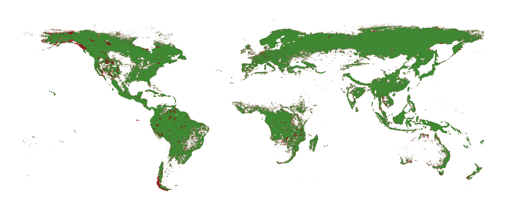

# Forest exposure file

## Step 1: Select forests

**1. Source:** Copernicus Land Cover
Map: https://cds.climate.copernicus.eu/cdsapp#!/dataset/10.24381/cds.006f2c9a?tab=overview
Description: Global map describing the land surface into 22 classes

**2. Raw file name:** "C3S-LC-L4-LCCS-Map-300m-P1Y-2020-v2.1.1.nc"

**3. Time selection:** 2020-01-01

**4. Classes chosen**:

* 50: tree_broadleaved_evergreen_closed_to_open
* 60: tree_broadleaved_deciduous_closed_to_open
* 61: tree_broadleaved_deciduous_closed
* 62: tree_broadleaved_deciduous_open
* 70: tree_needleleaved_evergreen_closed_to_open
* 71: tree_needleleaved_evergreen_closed
* 72: tree_needleleaved_evergreen_open
* 80: tree_needleleaved_deciduous_closed_to_open
* 81: tree_needleleaved_deciduous_closed
* 82: tree_needleleaved_deciduous_open
* 90: tree_mixed

**3. Changes to the resolution:**

1. Raw data: 300m (lat: 64800, lon: 129600)
2. Selection for further calculations: Every 10th grid cell was selected.
3. **Final resolution:** lat: 6408, lon: 12960 (~3 km)

**4. Exposure value:** applied value=1 to all the grid cells selected based on the classes chosen.

**5. First step file name:** forest_exp_v2.h5

**6. First step jupyter notebook:** forest_exp_trial3.ipynb

**Notes:**

1. Netcdf file available for display "f_exp.nc"
2. API requested from Copernicus:

        import cdsapi

        c = cdsapi.Client()
        
        c.retrieve(
            'satellite-land-cover',
            {
                'variable': 'all',
                'format': 'zip',
                'year': '2020',
                'version': 'v2.1.1',
            },
            'download.zip')

## Step 2: Assign region_id

**1. Files used:**

**a. input_file**: "forest_exp_v2.h5"

**b. _SHAPEFILE** = gpd.read_file("TM_WORLD_BORDERS-0.3.shp")

**2. Calculations**:

    a. Added a column "region_id" to the input_file and assigned the ISO3 code based on _SHAPEFILE using "vectorized" funtion. 

    b. All "None" values in the region_id were removed.

**3. Second step file name:** forest_exp_region_final.h5

**4. Second step jupyter notebook:** region_id.ipynb

## Step 3: Change the exposure "value"

**1. input_file**: "forest_exp_region_final.h5"

**2. Calculations**: Applied get_forestry_exp function by CLIMADA using MRIO to assign the exposure value according to
the sector 'Forestry and logging'. Function parameters used are presented below:

    exp = get_forestry_exp_new(
    countries=countries, 
    mriot_type='WIOD16',          
    mriot_year=2010,
    repr_sectors='Forestry and logging')

At each grid cell the value assigned is defined as follows:

    cnt_df['value'] = 1 / glob_prod.loc[iso3_cnt].loc[repr_sectors].sum().values[0]
       
    cnt_df['value'] = 1 / glob_prod.loc['ROW'].loc[repr_sectors].sum().values[0]

**3. Third step file name:** "forestry_values_MRIO.h5"

**4. Third step jupyter notebook:** exposures_forestry.ipynb

**Note:**

**IDEA:** The assigned value could be calculated as an average based on the grid cell number of each county, as defiled
below:

       cnt_df['value'] = glob_prod.loc[iso3_cnt].loc[repr_sectors].sum().values[0] / len(cnt_df)
   
       cnt_df['value'] = 1 / glob_prod.loc['ROW'].loc[repr_sectors].sum().values[0] ### TO BE UPDATED

The above was tried out and saved with **file name:** "forestry_values_MRIO_avg(draft).h5"

## What can be changed:

1. **Resolution:** We may be able to increase the resolution and try with every 5th grid cell (~1.5 km). Note: this will
   increase the calculation time for Step 2.

2. **region_id:** Above we used _SHAPEFILE to assign the region_id. CLIMADA exposures code could be tried out to assign
   the region_id using target_geometries = u_coord.get_land_geometry(iso3_cnt).

3. **Exposure value:** Refer to Step 3 note idea. Method to be discussed.

4. **Climada code:** We can try to apply the CLIMADA exposure code to the raw netcdf file from Step 1. (Need to take
   into consideration calculation time for all countries.)

# UPDATES:

**Classes chosen**:

* 50: tree_broadleaved_evergreen_closed_to_open
* 60: tree_broadleaved_deciduous_closed_to_open
* 61: tree_broadleaved_deciduous_closed
* 70: tree_needleleaved_evergreen_closed_to_open
* 71: tree_needleleaved_evergreen_closed
* 80: tree_needleleaved_deciduous_closed_to_open
* 81: tree_needleleaved_deciduous_closed
* 90: tree_mixed

1. **Update first step (no ISO3):** forest_exp_v3.h5
2. **Updated h5 file with ISO3:** forest_exp_region_final_v3.h5
2. **Updated nc file:** f_exp_new.nc
3. **Updated MRIO with average:** forestry_values_MRIO_avg(upd_2).h5

         cnt_df['value'] = glob_prod.loc[iso3_cnt].loc[repr_sectors].sum().values[0] / len(cnt_df)
         cnt_df["value"] = Row_country_production / len(cnt_df)

# UPDATES:

Steps taken to remove national parks and protected areas from the forestry exposure:

1. Downloaded OSM for 192 countries from Geofabrik, taking the following keys:

              osm_queries = ["boundary='national_park'", "boundary='protected_area'"]

The code is detailed in "step3_osm_download.py". It should be noted the Russia OSM file was manually downloaded from
Geofofabrik as the ISO3 code was not recognized using the code.

2. We extracted the national parks and protected areas as detailed in the code "step4_exclude_areas.py". The file saved
   is "forest_exp_osm_step4.h5".
3. Finally, we run the MRIO table on the update forestry exposure points as detailed in the file "
   step5_exposures_forestry.py". The final file is **"forestry_values_MRIO_avg(update).h5"**. It should be noted that
   the MRIO method was updated as follows:

        n_total = 195
        ROW_factor = (1 / (n_total - (len(set(r[0] for r in glob_prod.axes[0])) - 1)))
        Row_country_production = ((glob_prod.loc["ROW"].loc[repr_sectors].sum()).values[0] * ROW_factor)

        cnt_df['value'] = glob_prod.loc[iso3_cnt].loc[repr_sectors].sum().values[0] / len(cnt_df)
        cnt_df["value"] = Row_country_production / len(cnt_df) ## potential further update to be scaled with GDP

The green points represent the final forestry exposure points. The red points represent the excluded national parks and
protected areas.

# Next steps: GDP application

- For the ROW countries we used the GDP factor as detailed below:

            try:
                ROW_gdp_factor = ROW_gdp_lookup.loc[ROW_gdp_lookup['Country Code'] == iso3_cnt, 'Normalized_GDP'].values[0]
                ROW_country_production = ((glob_prod.loc['ROW'].loc[repr_sectors].sum()).values[0] * ROW_gdp_factor)
                cnt_df['value'] = ROW_country_production / len(cnt_df)
            except:
                print(f"For the country {iso3_cnt} there is no GDP value available, 0 value is assigned")
                ROW_gdp_factor = 0
                ROW_country_production = ((glob_prod.loc['ROW'].loc[repr_sectors].sum()).values[0] * ROW_gdp_factor)
                cnt_df['value'] = ROW_country_production / len(cnt_df)
- Final file name: "forestry_values_MRIO_avg(GDP).h5"

# Latest update:

### **Step 1:** Download deforestation dataset:

**Source:** https://storage.googleapis.com/earthenginepartners-hansen/GFC-2022-v1.10/download.html

**Description:** Year of gross forest cover loss event (lossyear): Forest loss during the period 2000-2022, defined as a
stand-replacement disturbance, or a change from a forest to non-forest state. Encoded as either 0 (no loss) or else a
value in the range 1-22, representing loss detected primarily in the year 2001-2022, respectively.

### **Step 2:** Change resolution and create mask

1. Increase the resolution from 30m to 3km: (latitude: 560000, longitude: 1440000) -> (latitude: 5600, longitude: 14400)
   by picking every 100th grid (limitation).
2. Create a mask (all values selected 1-22).
3. Create a h5 file for deforestation points.
4. Limitation: Tree cover loss may be the result of human activities, including forestry practices such as timber
   harvesting or deforestation (the conversion of natural forest to other land uses), as well as natural causes such as
   disease or storm damage. Fire is another widespread cause of tree cover loss, and can be either natural or
   human-induced.

### **Step 3:** Relate deforestation and forestry points

1. Find the nearest points between the two datasets with max distance 0.03 (resolution: 0.025-0.027).
2. This gives more rows than the forestry file hence duplicates are dropped (from 4,755,325 rows back to 4,754,693).
3. Then, if the points are considered closed, a weight of 2 is assigned. Points with double weight: 1,097,835.
4. Finally, the weight is then normalized by the following method in "assign_defor_weight.py".

File name of step 3: "forest_exp_osm_defor(v2).h5"

### **Step 4:** Apply the MRIO table on the updated forestry exposure points

1. For ROW countries scaling according to Forestry Production (instead of GDP): Agriculture, forestry, and fishing,
   value added (current US$) | Data (worldbank.org)
2. Apply “weight_norm” from Step 3 to MRIO values assignment.

Python file name: "step5_v2_exposures_forestry.py"
Final file name: "forestry_values_MRIO_avg(WB-v2).h5"