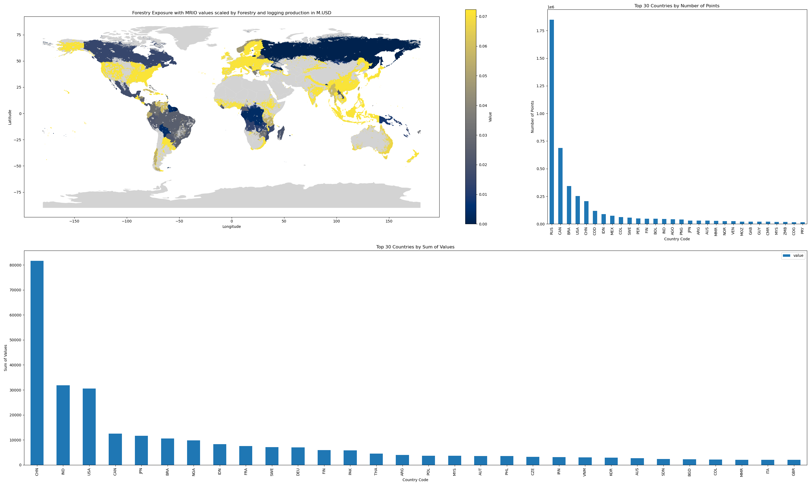

# Forest exposure file

## Step 1: Select forests

**1. Source:** Copernicus Land Cover
Map: https://cds.climate.copernicus.eu/cdsapp#!/dataset/10.24381/cds.006f2c9a?tab=overview
Description: Global map describing the land surface into 22 classes

**2. Raw file name:** "C3S-LC-L4-LCCS-Map-300m-P1Y-2020-v2.1.1.nc"

**3. Time selection:** 2020-01-01

**4. Classes chosen**:

* 50: tree_broadleaved_evergreen_closed_to_open
* 60: tree_broadleaved_deciduous_closed_to_open
* 61: tree_broadleaved_deciduous_closed
* 70: tree_needleleaved_evergreen_closed_to_open
* 71: tree_needleleaved_evergreen_closed
* 80: tree_needleleaved_deciduous_closed_to_open
* 81: tree_needleleaved_deciduous_closed
* 90: tree_mixed

**5. Changes to the resolution:**

1. Raw data: 300m lat: 64800, lon: 129600)
2. Selection for further calculations: Every 10th grid cell was selected.
3. **Final resolution:** lat: 6408, lon: 12960 (~3 km)

4. Exposure value: applied value=1 to all the grid cells selected based on the classes chosen.

**First step file name:** forest_exp_v3.h5

**First step jupyter notebook:** step1_forest_exp_trial3.ipynb

**Notes:**

1. Netcdf file available for display "f_exp_new.nc"
2. API requested from Copernicus:

        import cdsapi

        c = cdsapi.Client()
        
        c.retrieve(
            'satellite-land-cover',
            {
                'variable': 'all',
                'format': 'zip',
                'year': '2020',
                'version': 'v2.1.1',
            },
            'download.zip')

## Step 2: Assign region_id

**1. Files used:**

**a. input_file**: "forest_exp_v3.h5"

**b. _SHAPEFILE** = gpd.read_file("TM_WORLD_BORDERS-0.3.shp")

**2. Calculations**:

    a. Added a column "region_id" to the input_file and assigned the ISO3 code based on _SHAPEFILE using "vectorized" funtion. 

    b. All "None" values in the region_id were removed.

**3. Second step file name:** forest_exp_region_final_v3.h5

**4. Second step jupyter notebook:** step2_region_id.ipynb

## Step 3: remove national parks and protected areas

Steps taken to remove national parks and protected areas from the forestry exposure:

1. Downloaded OSM for 192 countries from Geofabrik, taking the following keys:

              osm_queries = ["boundary='national_park'", "boundary='protected_area'"]

    The code is detailed in **"step3_osm_download.py"**. It should be noted the Russia OSM file was manually downloaded from
Geofofabrik as the ISO3 code was not recognized using the code.

2. We extracted the national parks and protected areas as detailed in the code **"step4_exclude_areas.py"**. The file saved
   is **"forest_exp_osm_step4.h5"**.

The green points represent the final forestry exposure points. The red points represent the excluded national parks and
protected areas.

## Step 4: Download deforestation dataset:

**Source:** https://storage.googleapis.com/earthenginepartners-hansen/GFC-2022-v1.10/download.html (**stage0_download_deforestation.py**)

**Description:** Year of gross forest cover loss event (lossyear): Forest loss during the period 2000-2022, defined as a
stand-replacement disturbance, or a change from a forest to non-forest state. Encoded as either 0 (no loss) or else a
value in the range 1-22, representing loss detected primarily in the year 2001-2022, respectively.

**Change resolution and create mask:**

1. Increase the resolution from 30m to 3km: (latitude: 560000, longitude: 1440000) -> (latitude: 5600, longitude: 14400)
   by picking every 100th grid (limitation).
2. Create a mask (all values selected 1-22).
3. Create a h5 file for deforestation points (**"deforestation.h5"** from **"stage1_defor_merge.py"**).
4. Limitation: Tree cover loss may be the result of human activities, including forestry practices such as timber
   harvesting or deforestation (the conversion of natural forest to other land uses), as well as natural causes such as
   disease or storm damage. Fire is another widespread cause of tree cover loss, and can be either natural or
   human-induced.

**Relate deforestation and forestry points**

1. Find the nearest points between the two datasets with max distance 0.03 (resolution: 0.025-0.027).
2. This gives more rows than the forestry file ("forestry_exp_osm_step4.h5") hence duplicates are dropped (from 4,755,325 rows back to 4,754,693).
3. Then, if the points are considered closed, a weight of 2 is assigned. Points with double weight: 1,097,835.
4. Finally, the weight is then normalized by the following method in **"stage2_assign_defor_weight.py"**.

File name: **"forest_exp_osm_defor(v2).h5"**

## **Step 5:** Apply the MRIO table on the updated forestry exposure points

Applied get_forestry_exp function by CLIMADA using MRIO to assign the exposure value according to
the sector 'Forestry and logging'. Function parameters used are presented below:

    exp = get_forestry_exp_new(
    countries=countries, 
    mriot_type='WIOD16',          
    mriot_year=2011,
    repr_sectors='Forestry and logging')

1. For ROW countries scaling according to Forestry Production (instead of GDP): Agriculture, forestry, and fishing,
   value added (current US$) | Data (worldbank.org)
2. Apply “weight_norm” from Step 4 to MRIO values assignment.

Python file name: **"step5_v2_exposures_forestry.py"**
Final file name: **"forestry_values_MRIO_avg(WB-v2).h5"**

## Visualisation:

1. **Previous** version without deforestation and applying GDP scaling for ROW:

2. **Current version** with deforestation and applying World Bank production scaling for ROW:

3. **Sensitivity test:** Current version with deforestation and applying World Bank production scaling for ROW
   (sensitivity test with 10 weight on deforestation points):
